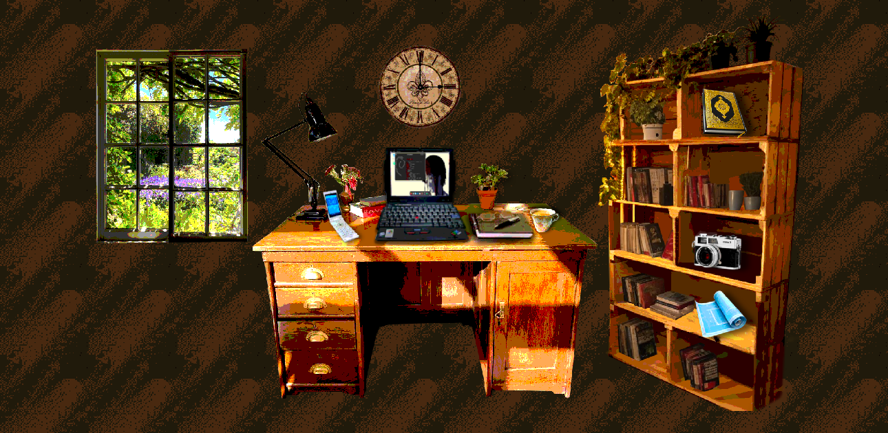

# Vagabond

A Personal Website that Shows Who I Am. It's a **Crib**, a place which represents **Me**.

## Why?

To Build a **Digital Identity**, a Webpage on which I can be Myself and not care what others think about me. on this Website, I'm going to share everything I want to, including Stuff About Me, My Religion, Hobbies etc.

## Live Demo:

Hosted on Github Pages. [Vagabond](https://trulyvagabond.github.io/Vagabond-Web/)

## Screenshots:

## Built With:

- **HTML5** and **CSS3** Only. cuz I don't know Javascript (yet). Based on the **Indie Web** vibe.

- AND [PHOTOPEA](https://photopea.com) THE GOAT

## Inspiration:

Greatly Inspired by the [ribo.zone](http://ribo.zone) website. Really liked his style and wanted to create something based on his style.

## Thanks to:

1: [Dollarchive.neocities](https://dollarchive.neocities.org/compendium/spine/borders) for **Borders**

2: [WikiMedia Commons](https://commons.wikimedia.org) for **Images**

3: [humantooth.neocities](https://humantooth.neocities.org/freefonts) for **Fonts**

4: [TextureTown](https://textures.neocities.org/) for **Backgrounds and Textures**.

